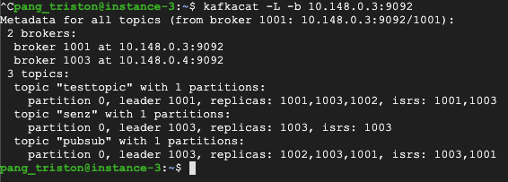

# CS3219 OTOT Assignment Task D
## Name: Triston Pang Erh Syen
## Github Repo: https://github.com/tristonpang/kafka-docker-cs3219

**Context**  
This project will set up a 3-node Apache Kafka + Zookeeper cluster (each node running on 1 server/virtual machine), and will then demonstrate PubSub messaging between nodes.
For this project, I used GCP Compute Engine VM instances to host my nodes, but you may use other platforms like Azure as well.

> If any of the commands fail (especially if it mentions permissions denied), try appending `sudo` to the front of the command.

### Setting up Kafka + Zookeeper cluster
1. Ensure that your 3 VM instances are set up and running.
2. Ensure that your VM instances all have Docker, Docker Compose, and Kafkacat installed. If they are running Linux environments, use `sudo apt-get install docker docker-compose kafkacat` to install these dependencies.
3. Clone this repo into your local machine, and replace `{ipAddress1}`, `{ipAddress2}`, and `{ipAddress3}`, with the IP addresses of your first, second, and third VM instances respectively.
3. Copy the `docker-compose.yml` file into each of your 3 VM instances' directories.
4. Start the Zookeeper and Kafka instances on your VMs via Docker Compose:
```
# Run on VM Instance 1
docker-compose up -d zookeeper1 kafka1

# Run on VM Instance 2
docker-compose up -d zookeeper2 kafka2

# Run on VM Instance 3
docker-compose up -d zookeeper3 kafka3
```
5. Ensure that Zookeeper and Kafka images are running via `docker ps`  


### PubSub Demonstration
1. In any VM instance, create a topic via this command:
```
docker run \
--rm ches/kafka kafka-topics.sh \
--create \
--topic {topicName} \
--replication-factor 3 \
--partitions 1 \
--zookeeper {ipAddress}:2181
```
where `{ipAddress}` represents the IP address of any of the VM instances, and `{topicName}` is the name of the topic. We set the replication factor to 3 in order to allow for successful replacement on failure of the master node.

2. Create publishers and consumers. Publishers send out messages (Pub), while consumers consume messages (Sub). Use the following commands:
```
# Create publisher - run on VM instance that you want as a publisher
kafkacat -P -b {ipAddress}:9092 -t {topicName}

# Create consumer - run on VM instance that you want as a consumer
kafkacat -C -b {ipAddress}:9092 -t {topicName}
```
Similarly, `{ipAddress}` represents the IP address of any of the VM instances.

3. Test out the PubSub messaging by sending messages from the publisher. The messages should appear on the consumer VM instances.


### Management of Master Node Failure
1. Run `kafkacat -L -b {ipAddress}:9092` on any of the VM instances to display the cluster metadata. You can view all brokers, topics in the cluster, as well as the master node or leader of each topic. In my example below, broker 1002 is the master node of `pubsub`:  


2. We will now simulate a master node failure. Take the VM instance that is serving as the master/leader node of a topic and run `docker stop {kafkaImage}` to stop the running Kafka image, where `{kafkaImage}` represents either `kafka1`, `kafka2`, or `kafka3`, depending on which VM instance is the master node of your topic.

3. Run `kafkacat -L -b {ipAddress}:9092` again on any of the other 2 VM instances. You will see that either one of these 2 VM instances has taken over as the master/leader node for the topic. In my example, broker 1003 has taken over as the master node of `pubsub`:  
